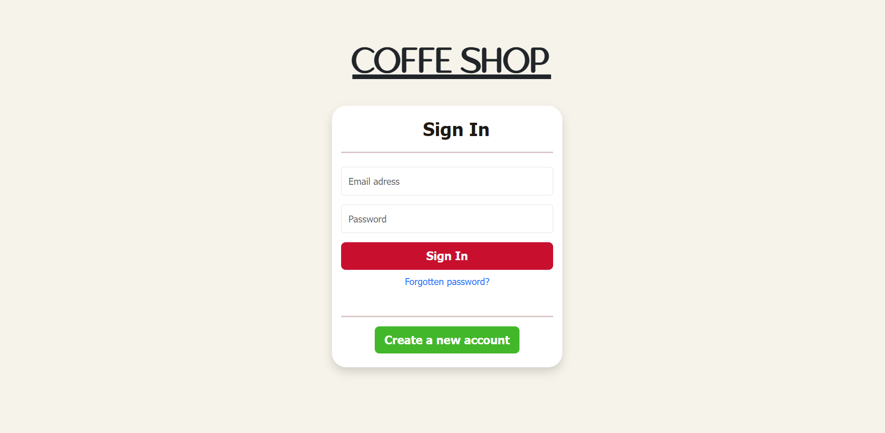
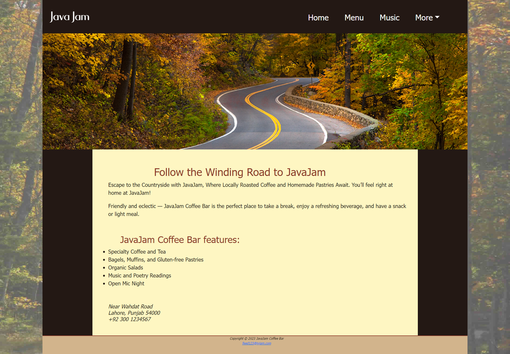
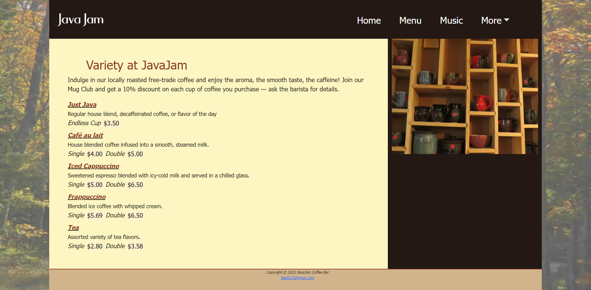
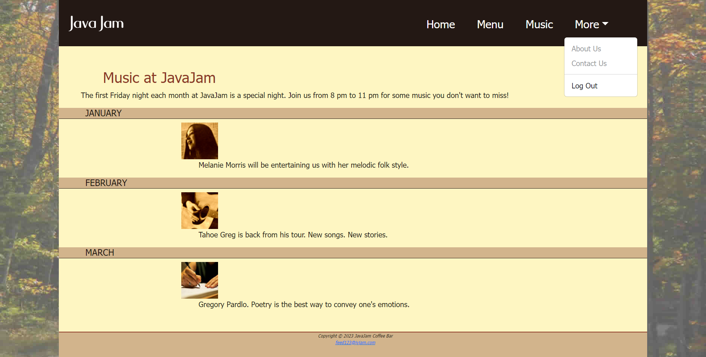

# JAVA-JAM
JAVA JAM is a coffee website that combines HTML, CSS, Bootstrap, and PHP for a dynamic backend. It offers a visually appealing design, interactive features, and personalized experiences. Users can explore premium brews, events, and engaging content, making it a virtual haven for coffee enthusiasts.
